# 🏗️ THE CHESS WIRE - PLATFORM ARCHITECTURE & FLOW

## 📋 **PLATFORM OVERVIEW**

TheChessWire.news is a comprehensive AI-powered chess journalism platform with 6 phases of functionality:

- **Phase 1**: Foundation & Core Platform (Authentication, Dashboard, Basic Features)
- **Phase 2**: AI Automation & Content Generation (News Discovery, EchoSage)
- **Phase 3**: Revolutionary Features (SoulCinema, Voice Narration)
- **Phase 4**: Scale & Vision (Advanced Analytics, Social Integration)
- **Phase 5**: Content Automation (Social Media, Video Generation)
- **Phase 6**: AI Chatbot (Bambai AI Assistant)

---

## 🏠 **1. HOMEPAGE FLOW**

```mermaid
graph TD
    A[User Visits Homepage] --> B[ParticleBackground Loads]
    B --> C[Bambai AI Auto-Plays Welcome Narration]
    C --> D[Status Badges Display]
    D --> E[Feature Cards Animate In]
    E --> F[User Clicks 'Begin Journey']
    F --> G[Redirect to /auth/gateway]
    
    D --> D1[🧠 Bambai AI Active]
    D --> D2[🛡️ Security Active]
    D --> D3[🌐 Global Network]
    
    E --> E1[🎭 Replay Theater]
    E --> E2[🧠 EchoSage]
    E --> E3[🎬 SoulCinema]
    E --> E4[📰 Stories]
```

### **Homepage Components:**
- **ParticleBackground**: Chess-themed floating particles
- **BambaiVoice**: AI voice narration with multiple modes
- **StatusBadges**: Real-time system status indicators
- **FeatureCards**: Animated cards for main features
- **ChessQueen**: Animated chess piece mascot

---

## 🔐 **2. USER JOURNEY FLOW**

### **Authentication Flow:**
1. **Gateway Page** (`/auth/gateway`)
   - Login/Register toggle
   - Social login options
   - Password requirements display

2. **Registration Process:**
   - Username validation (3+ characters)
   - Email validation
   - Password complexity (12+ chars, uppercase, lowercase, number, special char)
   - Email verification required

3. **Login Process:**
   - Email/password validation
   - JWT token generation (24-hour access, 7-day refresh)
   - HTTP-only cookies for security
   - Rate limiting (100 requests/hour per IP)

---

## 🧠 **3. KIMICHESSBRAIN INTEGRATION FLOW**

### **KimiChessBrain.ts Functions:**
- **`analyzeGame(pgn: string)`**: Main entry point
- **`validatePGN()`**: PGN format validation
- **`parseMetadata()`**: Extract game headers, players, event info
- **`parseMoves()`**: Parse move list with SAN notation
- **`analyzeOpening()`**: Classify chess openings
- **`identifyTacticalHighlights()`**: Find brilliant moves, blunders, tactics
- **`evaluateGame()`**: Overall game quality assessment

### **PGN Processing Flow:**
1. **Article Page** loads with PGN data
2. **KimiChessBrain** analyzes the PGN
3. **JSON Output** contains:
   - Game metadata (players, event, date)
   - Annotated move list
   - Opening classification
   - Tactical highlights
   - Game evaluation
4. **ReplayBoard** component renders interactive chessboard
5. **User** can replay moves with annotations

---

## 🎭 **4. REPLAY THEATER FLOW**

### **Replay Theater Components:**
- **ReplayBoard**: Interactive chessboard with move controls
- **MoveList**: Scrollable list of moves with annotations
- **PositionAnalysis**: Real-time position evaluation
- **VoiceNarration**: Bambai AI voice commentary
- **GameStats**: Move count, time, evaluation graph

---

## 🧠 **5. ECHOSAGE TRAINING FLOW**

### **EchoSage Components:**
- **TrainingBoard**: Interactive training chessboard
- **PuzzleEngine**: Tactical puzzle generation
- **ProgressTracker**: User improvement metrics
- **AICoach**: Personalized training recommendations
- **PerformanceAnalytics**: Detailed statistics

---

## 🎬 **6. SOULCINEMA FLOW**

### **SoulCinema Components:**
- **VideoGenerator**: HeyGen API integration
- **StyleSelector**: Different cinematic styles
- **NarrationEngine**: Bambai AI voice synthesis
- **MusicLibrary**: Background music selection
- **ProgressTracker**: Video generation status

---

## 📰 **7. NEWS DISCOVERY FLOW**

### **News Discovery Components:**
- **SourceMonitor**: Automated content monitoring
- **ContentAnalyzer**: AI-powered content analysis
- **ArticleGenerator**: Automated article creation
- **SocialPublisher**: Multi-platform content distribution
- **TrendAnalyzer**: Real-time trend detection

---

## 🤖 **8. BAMBAI AI CHATBOT FLOW (Phase 6)**

### **Bambai AI Components:**
- **ChatInterface**: User interaction component
- **QueryProcessor**: Natural language understanding
- **VectorManager**: Pinecone vector database integration
- **ResponseGenerator**: OpenAI GPT-4 integration
- **VoiceSynthesizer**: ElevenLabs voice synthesis
- **MemorySystem**: Conversation context management

---

## 🛡️ **9. SECURITY & MODERATION FLOW**

### **Security Layers:**
1. **Network Security**: Cloudflare WAF, DDoS protection
2. **Application Security**: Rate limiting, JWT validation
3. **AI Detection**: FraudSecurityAIGuardian, behavioral analysis
4. **Content Moderation**: Automated filtering, admin review

---

## 👨‍💼 **10. ADMIN TOOLS FLOW**

### **Admin Tools:**
- **UserManagement**: User accounts, permissions, actions
- **ContentModeration**: Article review, content filtering
- **SecurityMonitoring**: Real-time security alerts
- **AnalyticsDashboard**: Comprehensive platform metrics
- **SystemConfiguration**: Platform settings, feature toggles

---

## 🔄 **11. COMPLETE SYSTEM ARCHITECTURE**

---

## 🧪 **12. TESTING STRATEGY**

### **Phase-by-Phase Testing:**

#### **Phase 1 Testing:**
- [ ] Authentication flow (login/register)
- [ ] Dashboard functionality
- [ ] Basic navigation
- [ ] User profile management
- [ ] Security features

#### **Phase 2 Testing:**
- [ ] News discovery system
- [ ] Article generation
- [ ] EchoSage training interface
- [ ] Content moderation
- [ ] Admin tools

#### **Phase 3 Testing:**
- [ ] SoulCinema video generation
- [ ] Voice narration system
- [ ] Replay theater functionality
- [ ] PGN parsing and analysis
- [ ] Interactive chessboards

#### **Phase 4 Testing:**
- [ ] Analytics dashboard
- [ ] Performance monitoring
- [ ] Advanced user features
- [ ] Mobile responsiveness
- [ ] Cross-browser compatibility

#### **Phase 5 Testing:**
- [ ] Social media automation
- [ ] Content distribution
- [ ] Video generation pipeline
- [ ] Multi-platform publishing
- [ ] Content scheduling

#### **Phase 6 Testing:**
- [ ] Bambai AI chatbot
- [ ] Voice interactions
- [ ] Knowledge base integration
- [ ] Conversation memory
- [ ] Multi-turn dialogues

### **Integration Testing:**
- [ ] End-to-end user journeys
- [ ] API integration testing
- [ ] Database operations
- [ ] External service connections
- [ ] Error handling and recovery

---

## ⚠️ **13. POTENTIAL GAPS & DEPENDENCIES**

### **Missing Dependencies:**
1. **Chess Engine**: No chess engine integration for move validation
2. **PGN Library**: Could benefit from a dedicated PGN parsing library
3. **Image Processing**: No image processing for chess diagrams
4. **Real-time Features**: No WebSocket implementation for live features

### **Duplicate Logic:**
1. **PGN Parsing**: Multiple places handle PGN parsing
2. **Authentication**: Some auth logic duplicated across components
3. **Error Handling**: Inconsistent error handling patterns
4. **Validation**: Form validation logic could be centralized

### **Critical Considerations:**
1. **API Rate Limits**: Monitor external API usage
2. **Cost Management**: Track usage of paid services
3. **Performance**: Optimize for large PGN files
4. **Scalability**: Plan for user growth
5. **Backup Strategy**: Ensure data backup and recovery

---

## 🚀 **14. DEPLOYMENT READINESS**

### **Pre-Launch Checklist:**
- [ ] All external services configured
- [ ] Environment variables set
- [ ] Database migrations complete
- [ ] SSL certificates installed
- [ ] Monitoring systems active
- [ ] Security measures enabled
- [ ] Performance testing complete
- [ ] User acceptance testing done

### **Post-Launch Monitoring:**
- [ ] Real-time performance monitoring
- [ ] Error tracking and alerting
- [ ] User feedback collection
- [ ] Security incident monitoring
- [ ] Cost and usage tracking
- [ ] Content quality monitoring

---

## 📊 **15. SUCCESS METRICS**

### **Technical Metrics:**
- Page load time < 2 seconds
- API response time < 200ms
- 99.9% uptime
- < 1% error rate

### **User Metrics:**
- User registration rate
- Daily active users
- Feature adoption rates
- User engagement time
- Premium conversion rate

### **Content Metrics:**
- Articles generated per day
- Video generation success rate
- Social media engagement
- Content quality scores
- User-generated content

---

**🎯 TheChessWire.news is a comprehensive platform that seamlessly integrates AI-powered chess analysis, content generation, training systems, and social features into a unified user experience. The modular architecture allows for independent development and testing of each phase while maintaining system cohesion.** 